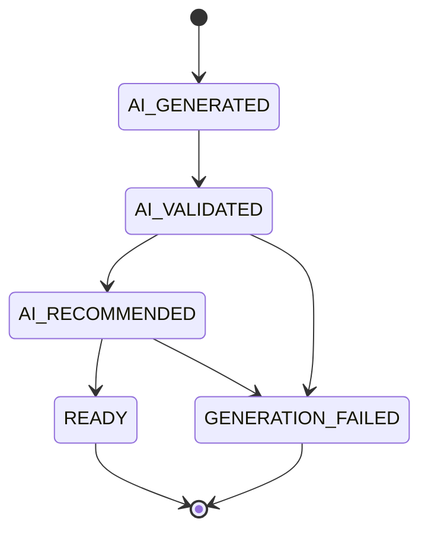
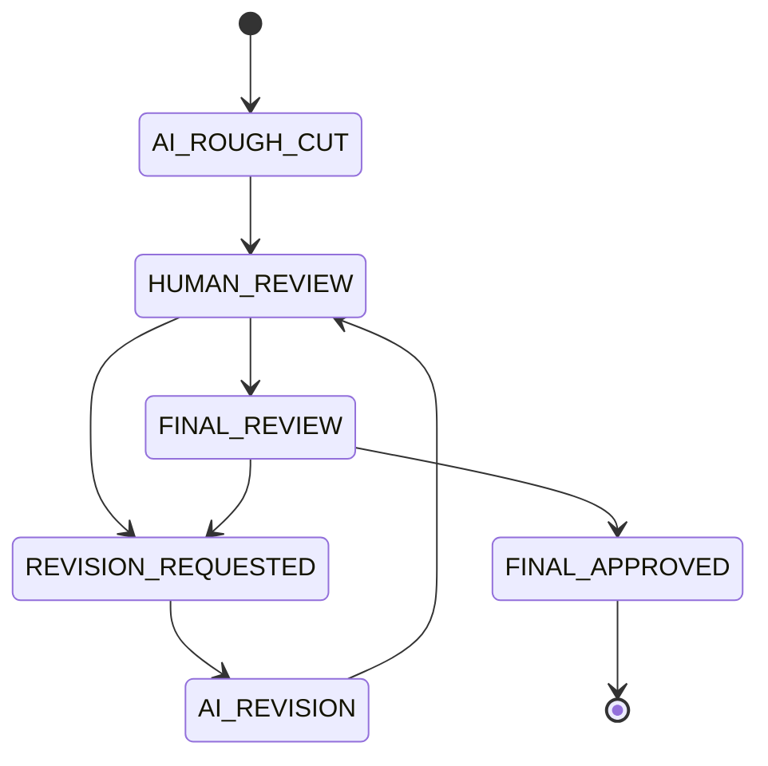
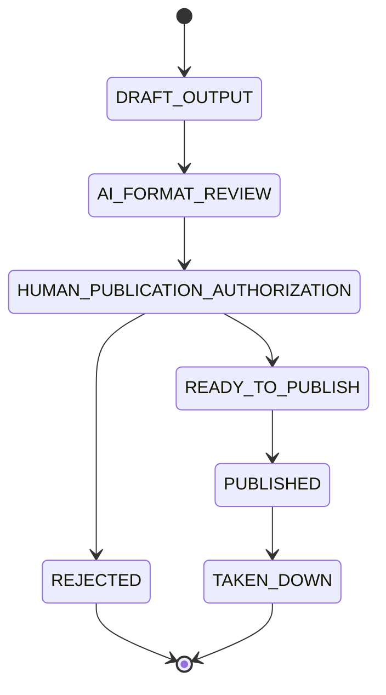

# Content Video OS — AI Creator / Shooting / Editing Contract

**Domain OS:** Content Video OS (new)
**Phase:** 0B — AI-Native Production Behavior
**Status:** `FROZEN 🔒` — Phase 0 architecture complete. **Phase 1 is `AUTHORIZED — VERTICAL SLICE ONLY`** (see `01_ContentVideoOS_Phase1_Implementation_Map.md`).
**Revision:** incorporates Phase 0C and Phase 0D — see Architecture doc §15 (ADR-013, ADR-014).
**Companion documents:** `00_ContentVideoOS_Product_Understanding_Report.md`, `00_ContentVideoOS_Architecture_Governance_v0.1.md`
**Implementation status:** No code, schema, or repository changes.

---

### Contents
A. AI Responsibility Matrix · B. Human Responsibility Matrix · C. AI Generation Lifecycle · D. Shooting Plan Schema · E. Media Asset Schema · F. Edit Plan Schema · G. Review / Approval State Machine · H. Multi-Output Model · I. Content Learning Feedback Loop · J. Open Questions

---

## A. AI Responsibility Matrix

AI's role in every row below splits into three tiers that are never interchangeable — **APPROVED, CVOS-P8** (Architecture doc §7): **Recommendation** (AI suggests an action), **Decision** (AI produces a structured, machine-readable decision inside a workflow a human already authorized), and **Execution** (a system adapter actually performs the external action, only after a human gate). AI recommending "Use Take 14" never means the other takes were deleted; AI generating an EditPlan that says "publish this video" never means the video was published.

| AI Function | Primary Input | Output Artifact | Never Does |
|---|---|---|---|
| AI Creator | An idea, topic, sentence, or past-performance data | ContentConcept (+ optional Script draft) | Overwrite the user's stated intent with an AI-judged "better" alternative |
| AI Shooting Planner | ContentConcept + Script + available Equipment + environment | ProductionPlan + Shot list | Commit to an actual shoot — scheduling/executing real-world time is a human act |
| Equipment Selector | Shot requirements + Equipment capability data | A ranked, reasoned equipment recommendation per shot | Silently substitute equipment without flagging the change |
| AI Media Analyst | A MediaAsset (raw) | MediaAnalysis (metadata, tags, recommendations) | Delete, move, or alter the source file |
| AI Edit Planner | MediaAsset + MediaAnalysis set, ContentConcept | EditPlan (an auditable decision list) | Render or execute the plan itself |
| AI Edit Executor (render) | A `READY` EditPlan | EditVersion (a rough-cut / revision file) | Mark its own output final or publish it |
| AI Revision Engine | Per-decision Review feedback + prior EditPlan | A new EditPlan version + EditVersion | Discard prior versions — they remain queryable |
| AI Content Learning Engine | AnalyticsSnapshot history + Publication record | ContentInsight + ContentRecommendation | Auto-create a Shoot or commit resources without human pickup |

## B. Human Responsibility Matrix

| Gate | Human Action | Why it can't be delegated |
|---|---|---|
| Concept / Script / Plan intervention *(optional, not a gate)* | Inspect, edit, or redirect any planning artifact at any point | Available whenever the human wants to steer — never required before the next stage generates |
| Production Go | Review the whole planning package at `READY` and authorize it (`authorizeProductionGo`) | Real-world time, resource cost, and safety — the first hard gate |
| Take verification override | Accept a flagged take anyway, or discard it | A judgment call an automated flag can't fully resolve |
| Rough Cut review | Feedback, per-decision or natural-language (KEEP/REMOVE/REPLACE/... or "shorten," "opening too slow," etc.) | Creative judgment on pacing, story, and tone |
| Final approval | Mark an EditVersion `FINAL_APPROVED` (the `HUMAN_FINAL_APPROVAL` action) | The last checkpoint before anything can be published |
| Publication authorization | Approve each ContentOutput into `PUBLISHED` (`HUMAN_PUBLICATION_AUTHORIZATION`) | A public, hard-to-fully-reverse action with brand/platform risk — separate from final creative approval |
| Deletion or overwrite of an approved artifact | Explicit delete/supersede command | Prevents accidental or AI-driven loss of history |
| Major changes after approval | Re-approval required | Approved isn't frozen forever, but changes must be visible, never silent |

## C. AI Generation Lifecycle

**Renamed and corrected under Phase 0D** (previously "AI Decision Lifecycle"). This is the generic, fully-automatic state machine for any AI-generated intermediate artifact — a Concept, a Script, a Production Plan, an Edit Plan. No human click is embedded in it. It is reused, not reinvented, at every AI-generation point in the pipeline.

| State | Meaning | Who triggers the next transition |
|---|---|---|
| `AI_GENERATED` | An AI capability has produced a first draft | AI, automatically |
| `AI_VALIDATED` | The draft passed structural/schema validation (well-formed, required fields present) | AI, automatically |
| `AI_RECOMMENDED` | The draft passed the AI's own quality bar | AI, automatically |
| `READY` | Prepared and available — consumed automatically by the next stage, and inspectable by the human at any time, but never blocked on a human click | AI, automatically (into the next stage); Human, optionally (to inspect, edit, or redirect) |
| `GENERATION_FAILED` *(ADR-018)* | Structural validation or the quality-bar check failed — a clearly-flagged, retryable dead end, never a silent stall inside `AI_GENERATED` | Human or a later AI pass may retry generation; nothing consumes a failed artifact downstream |

**What changed from Phase 0C.** The Phase 0C interpretive note required one explicit human approval action per artifact (Concept, then Script, then Plan) before the next stage could start. That reading is corrected: reaching `READY` requires no human action at all. Concept, Script, and Production Plan/Shot List/Equipment Recommendation now form one continuous automatic workflow, and the first mandatory human action is **Production Go** (Architecture doc §7–§8) — reviewing the whole planning package once it's `READY`, not approving each piece of it individually. The old `APPROVED` / `REJECTED` / `REVISION_REQUESTED` / `EXECUTED` states are retired from this generic chain — see ADR-013 for the full correction history, and superseded ADR-006.

**Staleness overlay — APPROVED, CVOS-P9** (Architecture doc §7): staleness applies from Production Go onward, not to the pre-`READY` planning chain, which has no approval yet to go stale — it simply regenerates automatically when its own inputs change. Once a package is authorized (`authorizeProductionGo`), if an upstream input changes afterward, that authorization is flagged and blocked from unlocking Shoot until a human re-confirms.

## D. Shooting Plan Schema

**ProductionPlan**

| Field | Type | Required | Notes |
|---|---|---|---|
| plan_id | ID | yes | |
| concept_id | ref → ContentConcept | yes | |
| script_id | ref → Script | yes | version-pinned |
| location / environment | text | no | |
| planned_date | date | no | |
| status | enum | yes | `DRAFT` / `READY` / `AUTHORIZED` / `IN_PROGRESS` / `COMPLETE` — `READY` reached automatically (AI Generation Lifecycle, §C); `AUTHORIZED` set by the human `authorizeProductionGo` command (Production Go gate, §8) |
| equipment_for_day | ref[] → Equipment | no | AI-recommended, human-confirmed |
| version | int | yes | |

**Shot**

| Field | Type | Required | Notes |
|---|---|---|---|
| shot_id | ID | yes | |
| plan_id | ref → ProductionPlan | yes | |
| purpose | text | yes | e.g. "Hook", "Talking Head" |
| scene | text | no | |
| camera_role | enum | yes | A-Cam / B-Cam / POV / Action / Static / Drone / Audio |
| recommended_equipment | ref → Equipment | no | AI-suggested |
| orientation | enum | yes | Vertical / Horizontal |
| framing | text | no | |
| camera_position | text | no | |
| movement | enum | no | Static / Handheld / Gimbal / Drone-move |
| subject | text | no | |
| audio_requirement | text | no | |
| estimated_duration_sec | number | yes | |
| priority | enum | yes | `ESSENTIAL` / `RECOMMENDED` / `OPTIONAL` |
| status | enum | yes | `NOT_STARTED` / `CAPTURED` / `VERIFIED` / `RECAPTURE_NEEDED` |
| notes | text | no | |

Shot capture status is a small, separate lifecycle from the plan's own approval status: `NOT_STARTED → CAPTURED → VERIFIED`, with a `RECAPTURE_NEEDED` branch proposed here (from `CAPTURED`, looping back to itself) for when fast in-field verification flags a problem. Not in the original brief — flagged for confirmation.

## E. Media Asset Schema

**MediaAsset**

| Field | Type | Required | Notes |
|---|---|---|---|
| asset_id | ID | yes | |
| source_file_ref | path / URI | yes | never mutated |
| hash | string | recommended | for dedup and integrity checking |
| capture_timestamp | datetime | no | from file metadata if available |
| equipment_id | ref → Equipment | no | |
| shoot_id | ref → Shoot | no | |
| shot_id | ref → Shot | no | |
| take_id | ref → Take | no | |
| media_type | enum | yes | video / audio / photo |
| duration_sec | number | no | |
| orientation | enum | no | |
| status | enum | yes | `IMPORTED` / `ANALYZED` / `ARCHIVED` |
| latest_analysis_id | ref → MediaAnalysis | no | convenience pointer only — MediaAnalysis itself is append-only |

**MediaAnalysis**

| Field | Type | Notes |
|---|---|---|
| analysis_id | ID | |
| asset_id | ref → MediaAsset | |
| analysis_version | int | append-only — re-analysis creates a new record, never overwrites one |
| quality | enum | `GOOD` / `ACCEPTABLE` / `POOR` |
| content_type | enum | `PRIMARY` / `B_ROLL` / `BACKUP` / `IRRELEVANT` |
| audio_quality | enum | `GOOD` / `NOISY` / `CLIPPED` / `SILENT` |
| visual_quality | enum | `STABLE` / `SHAKY` / `BLURRED` / `OVEREXPOSED` / `UNDEREXPOSED` |
| relevance | enum | `HIGH` / `MEDIUM` / `LOW` |
| flags | text[] | e.g. best_take, duplicate_of, pause, mistake, strong_reaction, broll_candidate, good_opener |
| generated_by | string | AI capability + version, for provenance |
| created_at | datetime | |

## F. Edit Plan Schema

**EditPlan** (versions in lockstep with its EditVersion)

| Field | Type | Notes |
|---|---|---|
| plan_id | ID | |
| edit_project_id | ref → EditProject | |
| version | int | |
| target_duration_sec | number | |
| platform_format | enum | TikTok / Reel / Short / Long-form / ... |
| narrative_structure | text | |
| selected_clips | ordered list of `{asset_id, in, out}` | |
| broll_insertions | list of `{asset_id, in, out, position}` | |
| captions | list / ref | |
| music | `{track_ref, level_curve}` | |
| audio_treatment | text | |
| transitions | list | |
| pacing_notes | text | AI reasoning, e.g. "long pause + repetitive speech" |
| reframing | per-platform crop/aspect notes | |
| status | enum | mirrors the AI Generation Lifecycle (§C) |
| generated_by | string | provenance |
| supersedes_version | ref → EditPlan (self) | nullable; used for revision chains |

**EditVersion**

| Field | Type | Notes |
|---|---|---|
| version_id | ID | |
| plan_id | ref → EditPlan | 1:1, same version number |
| preview_ref | path / URI | the rendered preview file |
| generation_timestamp | datetime | |
| approval_status | enum | mirrors the Review Lifecycle (§G) |

## G. Review / Approval State Machine

Two nested machines, not one — **APPROVED, ADR-005** (Architecture doc §6 has the full reconciliation of how the three source phases described this pipeline at different levels of detail). Edit/Review determines whether a content output is approved for publication; Publication determines whether that already-approved output is prepared, published, failed, or otherwise managed. Both stay independently auditable — collapsing them into one status field was explicitly rejected.

**EditVersion Review Lifecycle** (owned by ReviewEngine — this covers the **Rough Cut Review** and **Final Approval** gates from §8 / Architecture doc §7):

The action taken at `FINAL_REVIEW` is what Phase 0D names **HUMAN_FINAL_APPROVAL** — the transition into `FINAL_APPROVED` *is* that gate, not a separate state.

**Publication Lifecycle** (owned by PublicationEngine — the **Publication Authorization** gate from §8 / Architecture doc §7; can only start from a `FINAL_APPROVED` EditVersion):

*(Renamed from `HUMAN_APPROVAL` under Phase 0D, to match the gate's formal name and to keep it visibly distinct from `HUMAN_FINAL_APPROVAL` above — approving the edit is not approving the release.)*

**Per-decision review vocabulary** (submitted during `HUMAN_REVIEW`) — Phase 0D adds the natural-language column; AI translates either form into the same underlying EditPlan changes:

| Decision | Effect | Natural-language equivalent |
|---|---|---|
| KEEP | No change to that clip/element | "approve" |
| REMOVE | Cut from the next EditPlan version | — |
| REPLACE | Swap for a different clip/take | "use another take" |
| CHANGE_ORDER | Reorder in the next version | — |
| CHANGE_CAMERA | Swap the primary angle for that segment | — |
| CHANGE_B-ROLL | Swap or add a B-roll insertion | "change B-roll" |
| CHANGE_MUSIC | Swap track or adjust level curve | "change music" |
| CHANGE_CAPTION | Edit caption text or placement | "change caption" |
| CHANGE_HOOK | Regenerate the opening specifically | "opening too slow" |
| CHANGE_DURATION *(new, Phase 0D)* | Re-select clips against a shorter/longer target | "shorten" |
| CHANGE_PACING *(new, Phase 0D)* | Adjust cut rhythm / clip lengths without changing selection | "change pacing" |

If every decision is `KEEP` (the natural-language "approve"), the version moves to `FINAL_REVIEW`. Any other decision — including an overall "reject," which asks for a substantially different direction rather than one fix — moves to `REVISION_REQUESTED`, and only the flagged elements are handed back to EditPlanEngine; the rest of the plan carries forward unchanged.

Both lifecycles above carry the CVOS-P9 staleness overlay: a `FINAL_APPROVED` EditVersion's authorization to be consumed into a new ContentOutput, and a `HUMAN_PUBLICATION_AUTHORIZATION`'d Publication's authorization to reach `READY_TO_PUBLISH`, can each be revoked if upstream state drifts before that next step actually runs. Neither `FINAL_APPROVED` nor `HUMAN_PUBLICATION_AUTHORIZATION` is retroactively rewritten by this — only forward authorization is affected.

## H. Multi-Output Model

One `FINAL_APPROVED` EditVersion can produce several ContentOutputs. Each references — never duplicates — the source EditVersion and its underlying media, and each gets its own identity, render parameters, and Publication lifecycle.

| ContentOutput | Source | Typical format constraint | Own lifecycle |
|---|---|---|---|
| TikTok variant | the FINAL_APPROVED EditVersion (referenced) | ≤45s, vertical, native captions | independent Draft → Published |
| Instagram Reel variant | same EditVersion | ≤30s, vertical | independent |
| YouTube Short variant | same EditVersion | ≤60s, vertical | independent |
| YouTube long-form variant | same EditVersion | 3–5 min, horizontal or vertical | independent |
| Story / Trailer / Teaser variants | same EditVersion | platform-specific | independent |

## I. Content Learning Feedback Loop

`Publication` → *(periodic pull)* → `AnalyticsSnapshot` — append-only time series → *(aggregated across snapshots, compared to historical baseline)* → `ContentInsight` — a pattern, e.g. "hooks under 2 seconds outperform the recent average" → *(one or more Insights justify)* → `ContentRecommendation` — reason, relationship to prior content, expected effort, suggested format/hook/equipment, confidence → `createContentIdea(source = AI_RECOMMENDATION)` → back into the Idea backlog, closing the loop.

The Recommendation always carries its justifying Insight(s) by reference, so a human reviewing it can trace *why* — never just *what*.

## J. Open Questions

- What granularity should "confidence" take on a Recommendation — numeric score, or a qualitative band (High/Medium/Low)?
- Should the AI Revision Loop (`HUMAN_REVIEW ⇄ AI_REVISION`) have a maximum iteration count before requiring the human to edit outside the system entirely?
- Is Shoot Mode's fast take-verification the same underlying AI capability as MediaAnalysisEngine's deep batch analysis, invoked differently — or genuinely two different capabilities? (See Architecture doc, ShootEngine vs. MediaAnalysisEngine.)
- How is analytics data actually obtained per platform? API access differs a lot, and some platforms don't expose retention/completion data at all — this needs platform-by-platform research before AnalyticsEngine's adapter contract can be finalized.
- The equipment/Inventory OS *principle* is resolved (Production Capability Model, never an asset inventory — Architecture doc §10); *whether/when* Inventory OS reconciliation happens is still `OPEN — PENDING ARCHITECTURAL DECISION`, same as Product Understanding Report §14 (#3).
- `RESOLVED under Phase 0D`: neither Concept nor Script has an individual approval gate — both auto-continue as part of the planning package. The human's first mandatory checkpoint is Production Go, reviewing the whole package at once (§C, §G; Architecture doc §7–§8).
