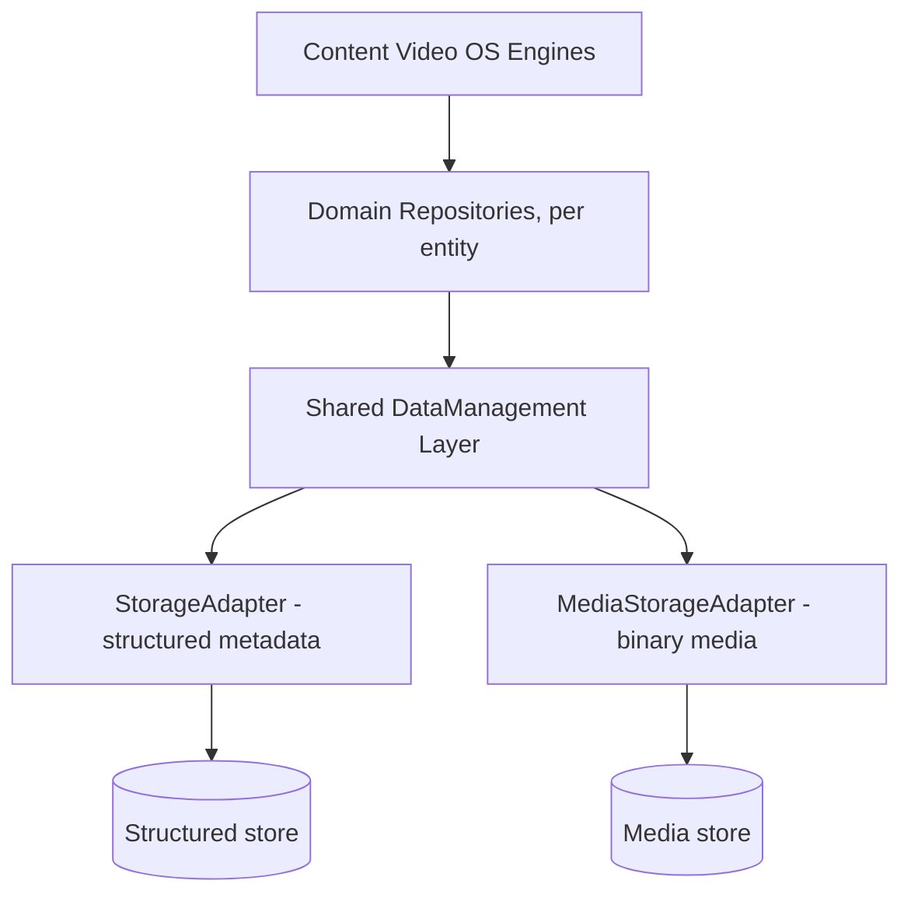
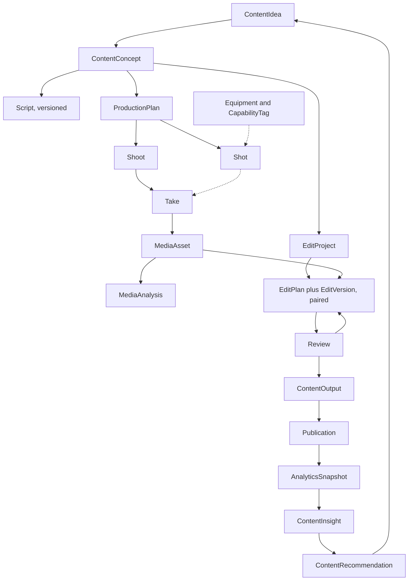

# Content Video OS — Architecture & Governance v0.1

**Domain OS:** Content Video OS (new)
**Phase:** 0 — Domain OS Architecture Establishment
**Status:** `FROZEN 🔒` — Phase 0C review, Phase 0D correction, and the Phase 0 Final Consistency Audit are all complete; every ADR (§15) is `APPROVED`. **Phase 0 architecture is frozen** and is not to be reopened except for a genuine contradiction, missing invariant, or implementation-blocking ambiguity discovered during Phase 1. **Phase 1 is `AUTHORIZED — VERTICAL SLICE ONLY`** (see the companion `01_ContentVideoOS_Phase1_Implementation_Map.md`). Phase 2, Phase 3, and any other-OS modification remain `NOT AUTHORIZED`.
**Revision:** incorporates Phase 0C and Phase 0D point-by-point; §15's ADR table is the definitive list of what changed, including what Phase 0D superseded.
**Companion documents:** `00_ContentVideoOS_Product_Understanding_Report.md`, `00_ContentVideoOS_AI_Production_Contract.md`
**Implementation status:** No code, schema, or repository changes. Nothing here touches PersonalLifeOS, Rider OS, Property OS, Finance OS, or any shared UEF/governance file.

**Conventions used below:** `PascalCase` for entities, `camelCase` for commands, past-tense `PascalCase` for events, `SCREAMING_SNAKE_CASE` for states/enums.

---

### Contents
1. Architecture Overview · 2. Domain Model · 3. Engine Ownership Map · 4–5. Command & Event Map · 6. State Machines · 7. AI Governance Contract · 8. Human Approval Contract · 9. Media Model · 10. Equipment Model · 11. External Adapter Boundary · 12. Dashboard Ownership · 13. Recovery Model · 14. Test Governance · 15. ADR List · 16. File Map · 17. Project State

---

## 1. Architecture Overview

**Domain boundary.** Content Video OS owns: content concepts, production planning, shooting plans, media relationships, editing decisions, review state, content outputs, the publication lifecycle, content analytics, and content learning. It does not own: generic file management, the video-editing engine itself, AI model hosting, social platforms, or any responsibility already held by PersonalLifeOS, Finance OS, Rider OS, or Property OS.

**Cross-OS data boundary — APPROVED, ADR-012.** Content Video OS may consume information from other Domain OSes for content intelligence, but must never duplicate or assume ownership of another OS's authoritative domain truth. Illustrative future integration points — none implemented in Phase 1, all gated behind an adapter/query contract rather than shared database ownership: Rider OS (activity/experience signals → Content Idea generation), Property OS (property-related experiences → Content Idea generation), Finance OS (financial trends/personal-finance topics → Content Idea generation), Inventory OS (equipment availability/physical-asset state → Production Planning), PersonalLifeOS (user execution context → optional content scheduling/workflow integration). The principle is approved; every specific integration remains `OPEN — PENDING ARCHITECTURAL DECISION` and unauthorized.

**Universal lifecycle mapping.** The established `Request → Planner → Decision → Execution → History → Projection → Insights` lifecycle maps onto this domain as:

`Content Request → Content Planner (Concept/Script/Production) → Content Decision (approvals) → Production Execution (shoot/edit/render/publish) → Content History (events) → Content Projection (dashboards) → Content Insights (learning)`

**Layering.** Content Video OS follows the same Repository + shared DataManagement pattern already converged on across the ecosystem: each engine owns and queries its own Repository in business language; Repositories sit on a shared, business-agnostic DataManagement layer (`read`/`append`/`update`/`archive`/`backup`); DataManagement sits on a StorageAdapter.

This OS extends that pattern in one respect the brief calls out explicitly: video is binary and large, where every other OS in this ecosystem has handled structured, small records. **APPROVED (ADR-004):** split the adapter in two — `StorageAdapter` for structured/metadata records (as today) and a new `MediaStorageAdapter` for binary media — both still governed by the same DataManagement discipline (declarative `read`, mode `CURRENT`/`CURRENT_AND_ARCHIVE`/`ARCHIVE_ONLY`/`AUTO`). Structured storage holds content metadata, state, decisions, relationships, AI analysis, approvals, and analytics; media storage holds video, audio, images, rendered outputs, and thumbnails. The domain layer talks to both only through these two interfaces — **which storage provider sits behind either one remains an explicit `OPEN — PENDING ARCHITECTURAL DECISION`** (§11), never to be settled by convenience or by defaulting to whatever the rest of the ecosystem happens to use.

**Cross-engine rule.** An engine mutates only the entities it owns. Any effect on another engine's data happens by calling that engine's command — never by a direct write. (This is why, for example, ContentLearningEngine cannot write a ContentIdea directly; see §3.)

## 2. Domain Model

| Entity | Cardinality note |
|---|---|
| ContentIdea | Many, independent of any Concept; a backlog |
| ContentConcept | 1 per adopted Idea; **serves as the stable project identity for everything downstream** |
| Script | Many per Concept, versioned |
| ProductionPlan | 1 active per Concept (versioned), contains many Shots |
| Shot | Many per ProductionPlan |
| Equipment | Many, independent instances |
| CapabilityTag | A small controlled vocabulary, referenced by Equipment and by Shot |
| Shoot | Many per ProductionPlan (a plan can be shot across more than one session) |
| Take | Many per Shot, linked through the Shoot it happened in |
| MediaAsset | Many per Take (and per Shoot generally) |
| MediaAnalysis | Many per MediaAsset, append-only/versioned |
| EditProject | 1 per Concept |
| EditPlan | Many per EditProject, versioned |
| EditVersion | 1:1 with each EditPlan version |
| Review | 1 per EditVersion review round |
| ContentOutput | Many per Concept (one per platform/format), each referencing one FINAL_APPROVED EditVersion |
| Publication | 1 per ContentOutput publish event (can change state after publish) |
| AnalyticsSnapshot | Many per Publication, append-only time series |
| ContentInsight | Many, derived across snapshots/publications |
| ContentRecommendation | Many, each citing one or more Insights, each producing one ContentIdea |

**Normalization decisions** (candidates from the brief, and what happened to each):

- **ContentIdea vs. ContentConcept** — kept separate. An Idea can be a one-liner sitting untouched in a backlog for weeks; a Concept is a ~12-field structured, AI-generated proposal. Different shape, different lifecycle.
- **Script** — kept as a first-class, independently versioned entity rather than an embedded Concept field, because the brief explicitly requires multiple scripts per concept.
- **ProductionPlan / Shot** — kept as parent/child. **Proposed (folds into ADR-001):** the candidate `ShotListEngine` is merged into `ProductionPlanEngine` — a Shot has no independent lifecycle without its parent Plan, so a second engine would only fragment ownership. The `Shot` *entity* stays distinct, because its capture-status lifecycle (`NOT_STARTED → CAPTURED → VERIFIED`) is genuinely independent of the Plan's own approval status.
- **Equipment / EquipmentCapability** — `Equipment` stays a full entity; `EquipmentCapability` is demoted from a candidate entity-with-lifecycle to `CapabilityTag`, a lightweight controlled vocabulary. It doesn't need its own transactional history to do its job.
- **Shoot / Take** — kept separate. `Take` is the traceability link between a planned `Shot` and a captured `MediaAsset`, and one Shot can have several Takes.
- **MediaAsset / MediaAnalysis** — kept separate, and `MediaAnalysis` is explicitly append-only/versioned so a re-analysis never overwrites a prior AI judgment (this is a governance invariant as much as a modeling choice — see CVOS-P4/P6).
- **EditProject / EditPlan / EditVersion** — `EditPlan` and `EditVersion` always version together as a paired unit; `EditProject` is the stable container per Concept.
- **ContentOutput / Publication** — kept separate. A ContentOutput can exist at `READY_TO_PUBLISH` before any Publication record exists, and a Publication keeps changing state after publish (e.g., `TAKEN_DOWN`).
- **AnalyticsSnapshot / ContentInsight / ContentRecommendation** — kept as a three-tier funnel (raw → pattern → action). This directly mirrors the `Document_Inventory` / `Recommendations` separation already proven in Knowledge Governance OS: raw scan data and the recommendations derived from it are different sheets with different lifecycles there, for the same reason.
- **No separate `ContentProject` wrapper entity — APPROVED, ADR-002.** `ContentConcept` represents the authoritative content-production aggregate. Script, ProductionPlan, Shot, Shoot, Take, MediaAsset, EditProject, EditVersion, Review, ContentOutput, Publication, AnalyticsSnapshot, and ContentInsight all hang off it, directly or transitively, and none of them has an identity independent of the Concept they belong to. (ContentRecommendation is deliberately excluded from this list — it cites Insights and produces a new ContentIdea, which starts a *different* Concept, so it never belongs to any one Concept's tree.) Introducing a further `ContentProject` wrapper above `ContentConcept` would just add a redundant identity layer.

## 3. Engine Ownership Map

**ContentIdeaEngine**
- Responsibility: Capture and triage raw content opportunities, whether typed by the human or proposed by ContentLearningEngine.
- Inputs: A free-text idea from the human; or a ContentRecommendation.
- Outputs: A ContentIdea record.
- Persistence: Owns ContentIdea.
- Commands: `createContentIdea`, `promoteContentIdea`*, `discardContentIdea`*.
- Events: `ContentIdeaCreated`, `ContentIdeaPromoted`, `ContentIdeaDiscarded`.
- External dependencies: None.
- Invariant: An Idea's `source` (`USER` or `AI_RECOMMENDATION`) is set at creation and never changed.
- Failure mode: Repeated AI recommendations proposing near-duplicate ideas. Mitigation direction (open, undesigned): a similarity check before creation.

**ContentConceptEngine**
- Responsibility: Turn a promoted Idea into a structured, production-ready Concept.
- Inputs: A promoted ContentIdea; optionally, prior ContentConcept history for voice consistency.
- Outputs: A ContentConcept, progressing automatically through the AI Generation Lifecycle to `READY` (no human action required — Phase 0D correction, §7 CVOS-P7).
- Persistence: Owns ContentConcept.
- Commands: `createContentConcept`; `approveContentConcept`*, `rejectContentConcept`*, `reviseContentConcept`* remain available for **optional** human intervention (explicitly lock in, discard, or redirect a Concept) but are never required before ScriptEngine consumes it.
- Events: `ContentConceptGenerated`, `ContentConceptApproved`, `ContentConceptRejected`.
- External dependencies: AI Provider adapter.
- Invariant: A human-edited field is never silently overwritten by a later AI regeneration.
- Failure mode: AI Provider timeout or malformed output — must leave the Concept in a clearly-flagged, retryable state, not stuck in `AI_GENERATED` indefinitely.

**ScriptEngine**
- Responsibility: Generate and version spoken/narrative content for a Concept.
- Inputs: A `READY` ContentConcept (no human approval required — Phase 0D).
- Outputs: A Script, progressing automatically to `READY`.
- Persistence: Owns Script.
- Commands: `createScript`*; `approveScript`*, `reviseScript`* remain available for optional human intervention, never a required gate.
- Events: `ScriptGenerated`, `ScriptApproved`.
- External dependencies: AI Provider adapter.
- Invariant: Multiple Script versions coexist; every downstream reference pins one explicit version.
- Failure mode: Same AI-provider failure class as ContentConceptEngine.

**ProductionPlanEngine** (absorbs the candidate Shot-List engine — see §2)
- Responsibility: Turn Concept + Script + available Equipment + environment into a shooting plan and its ordered Shot List, and own the **Production Go** gate — the first hard human checkpoint (Phase 0D correction, §7 CVOS-P7).
- Inputs: A `READY` Concept and Script (no human approval required to start), EquipmentEngine's current inventory, a stated location.
- Outputs: A ProductionPlan containing an ordered set of Shots, reaching `READY` automatically; then, on human action, `AUTHORIZED`.
- Persistence: Owns ProductionPlan, Shot.
- Commands: `createProductionPlan`, `createShot`; `authorizeProductionGo`* — **human-only**, reviews the whole planning package (Concept + Script + Plan + Shot List + Equipment recommendation) at once and transitions ProductionPlan from `READY` to `AUTHORIZED`. Supersedes the earlier `approveProductionPlan`* candidate, which implied per-artifact approval.
- Events: `ProductionPlanCreated`, `ShotCreated`, `ProductionGoAuthorized`*.
- External dependencies: AI Provider adapter (planning reasoning); reads EquipmentEngine.
- Invariant: A Shot marked `ESSENTIAL` cannot be silently dropped by a later AI revision without an explicit flag. `authorizeProductionGo` cannot be called against a package that isn't fully `READY`, and it is the **only** command that may set `AUTHORIZED` — no AI action, automatic process, or other command can produce that status. Once `AUTHORIZED`, any change to the Concept, Script, ProductionPlan itself, its Shot List, or its Equipment recommendation invalidates the authorization per CVOS-P9 — not just a Script change specifically.
- Failure mode: The Script changes after the Plan was generated but before `READY` — the Plan goes stale and regenerates (§ Stale-State, below; this is pre-authorization and routine). If *any* of Concept, Script, Plan, Shot List, or Equipment changes *after* `authorizeProductionGo`, `AUTHORIZED` is flagged stale per CVOS-P9 and `startShoot` is blocked until a human re-confirms — this is post-authorization and consequential.

**EquipmentEngine**
- Responsibility: Own equipment/capability reference data; answer "what should I bring" by matching a Shot's stated capability need to tagged Equipment.
- Inputs: A capability requirement from ProductionPlanEngine (e.g., "POV, weather-exposed").
- Outputs: A ranked equipment recommendation with a stated reason.
- Persistence: Owns Equipment, CapabilityTag.
- Commands: `registerEquipment`*, `updateEquipmentCapability`* — both human-entered (a person telling the system what they own); `recommendEquipmentForShot`* — AI-side, a recommendation only.
- Events: `EquipmentRegistered`, `EquipmentUpdated`.
- External dependencies: None assumed for v0.1 — **proposed as deterministic rule-matching, not an AI call** (ADR-008), cheaper and more reliable. Open question: a possible future dependency on Inventory OS as the equipment source of truth (see §10).
- Invariant: Every recommendation cites the matched capability, never a brand/model preference alone.
- Failure mode: New gear with no matching capability tag — falls back to an explicit `UNCLASSIFIED` state rather than blocking the recommendation.

**ShootEngine**
- Responsibility: Run "Shoot Mode" — per-shot capture status in the field, and fast/lightweight take verification.
- Inputs: An `AUTHORIZED` ProductionPlan's Shot list (precondition: Production Go has been given — §7 CVOS-P7); a captured Take.
- Outputs: Updated Shot/Take status; a fast verification result (duration, framing, orientation, blur, exposure, audio, subject visibility).
- Persistence: Owns Shoot, Take.
- Commands: `startShoot`, `recordTake`, `verifyTake`*, `completeShoot`*.
- Events: `ShootStarted`, `TakeRecorded`, `TakeVerified`, `ShootCompleted`.
- External dependencies: AI Provider adapter — a fast/lightweight path, architecturally distinct from MediaAnalysisEngine's deep batch path even where the underlying capability overlaps.
- Invariant: `startShoot` is rejected outright unless its ProductionPlan is `AUTHORIZED` — this precondition is enforced by the command itself, not merely assumed from what it's given; there is no path from `READY` (or any other status) into a running Shoot that skips `authorizeProductionGo`. `verifyTake` never deletes a Take, however poor — it only flags.
- Failure mode: No connectivity in the field. Verification should degrade to `UNVERIFIED` rather than blocking the capture log.

**MediaEngine**
- Responsibility: Deterministic ingestion — import, hash/identify, and link raw files to Shoot/Take/Shot/Concept.
- Inputs: A raw media file from a device or card.
- Outputs: A MediaAsset record.
- Persistence: Owns MediaAsset.
- Commands: `importMedia`.
- Events: `MediaImported`.
- External dependencies: MediaStorageAdapter (§1, ADR-004).
- Invariant: The source file is never moved, renamed in place, or deleted by this engine or any other.
- Failure mode: A corrupted or partial file — must not create a MediaAsset pointing at unreadable data without flagging it.

**MediaAnalysisEngine**
- Responsibility: AI-driven, deep batch analysis of imported footage. Deliberately separate from MediaEngine's deterministic ingestion, the same "deterministic core vs. AI boundary" split already used in Knowledge Governance OS.
- Inputs: A MediaAsset.
- Outputs: A MediaAnalysis record.
- Persistence: Owns MediaAnalysis.
- Commands: `analyzeMedia`.
- Events: `MediaAnalyzed`.
- External dependencies: AI Provider adapter.
- Invariant: Analysis is additive and versioned — re-analysis never overwrites a prior MediaAnalysis record.
- Failure mode: AI misjudgment (e.g., a good take marked `POOR`) — the human must be able to override this in Review without editing the analysis record itself.

**EditPlanEngine**
- Responsibility: The AI reasoning layer producing an auditable Edit Plan — decisions only, no rendering.
- Inputs: MediaAsset + MediaAnalysis set, the Concept (already past Production Go by this point in the pipeline), and (on revision) prior Review feedback.
- Outputs: An EditPlan, `AI_GENERATED`, versioned.
- Persistence: Owns EditPlan.
- Commands: `createEditPlan` (used for both the initial plan and every revision).
- Events: `EditPlanCreated`.
- External dependencies: AI Provider adapter.
- Invariant: Every clip selection, cut, and insertion decision carries a stated reason.
- Failure mode: The plan references a MediaAsset since re-analyzed as unusable (stale state).

**EditEngine**
- Responsibility: Execute a `READY` EditPlan (no human approval required — Phase 0D) against the external video-editing engine to produce the rendered EditVersion.
- Inputs: An EditPlan.
- Outputs: An EditVersion.
- Persistence: Owns EditVersion.
- Commands: `generateRoughCut`.
- Events: `RoughCutGenerated`.
- External dependencies: Video Editing Engine adapter.
- Invariant: Never marks its own output `FINAL_APPROVED` or `PUBLISHED` — those are human-only gates (§7).
- Failure mode: Render failure or timeout — must be observable and must not silently retry into a duplicate EditVersion.

**ReviewEngine**
- Responsibility: Capture per-decision human feedback on an EditVersion; drive the revision loop.
- Inputs: An EditVersion; a set of per-clip decisions.
- Outputs: A Review record; a transition to `FINAL_APPROVED` or a `RevisionRequested` event back to EditPlanEngine.
- Persistence: Owns Review.
- Commands: `submitForReview`, `approveEdit`, `requestRevision`.
- Events: `ReviewSubmitted`, `EditApproved`, `RevisionRequested`.
- External dependencies: None.
- Invariant: `FINAL_APPROVED` is terminal for that EditVersion's own content — a later change requires a new version, never a mutated approval. (Independent of CVOS-P9, §7: the approval record itself never changes, but its authorization to be *used* downstream can still be revoked if upstream state drifts.)
- Failure mode: A review submitted against a Plan that changed underneath it (stale state).

**PublicationEngine**
- Responsibility: Render platform-specific ContentOutput variants from a `FINAL_APPROVED` EditVersion; manage the Publication lifecycle.
- Inputs: A `FINAL_APPROVED` EditVersion; a target platform/format.
- Outputs: A ContentOutput; a Publication once actually published.
- Persistence: Owns ContentOutput, Publication.
- Commands: `createContentOutput`, `authorizePublication`, `publishContent`, `takeDownPublication`*. *(Renamed from `approvePublication` under this audit — "approve" language echoed Final Approval too closely; the action here is authorization, not approval.)*
- Events: `ContentOutputCreated`, `PublicationAuthorized`, `ContentPublished`, `PublicationTakenDown`.
- External dependencies: Publishing Platform adapters.
- Invariant: `publishContent` only executes after `HUMAN_PUBLICATION_AUTHORIZATION` — never from `AI_FORMAT_REVIEW` alone.
- Failure mode: A platform API failure mid-publish — must not report `PUBLISHED` unless the platform actually confirms it.

**AnalyticsEngine**
- Responsibility: Pull and record performance metrics for each Publication.
- Inputs: A Publication's platform content ID.
- Outputs: An AnalyticsSnapshot.
- Persistence: Owns AnalyticsSnapshot.
- Commands: `recordAnalytics`.
- Events: `AnalyticsRecorded`.
- External dependencies: Analytics Provider adapters (typically the same platforms as publishing).
- Invariant: Append-only time series — a new pull never overwrites a prior Snapshot.
- Failure mode: A platform doesn't expose a given metric — must record partial data, never fabricate a number.

**ContentLearningEngine**
- Responsibility: Compare current performance against historical baseline; generate insights and next-content recommendations.
- Inputs: AnalyticsSnapshot history across Publications; ContentConcept/Script history.
- Outputs: A ContentInsight; a ContentRecommendation.
- Persistence: Owns ContentInsight, ContentRecommendation.
- Commands: `generateContentInsight`, `generateContentRecommendation`.
- Events: `ContentInsightGenerated`, `ContentRecommendationGenerated`.
- External dependencies: AI Provider adapter.
- Invariant: Never writes a ContentIdea directly — calls ContentIdeaEngine's `createContentIdea` command, respecting the cross-engine ownership rule (§1).
- Failure mode: Too little historical data to support a real pattern — must degrade to "not enough data yet," never fabricate one.

**Stale-state note.** ProductionPlanEngine, EditPlanEngine, and ReviewEngine can each be handed a downstream artifact after its upstream source changed — this is exactly the risk CVOS-P9 (§7) now formally governs. None of them may auto-invalidate silently or execute against outdated state; each surfaces the staleness as an explicit condition for the human or the next AI pass to resolve.

## 4–5. Command Map & Event Map

*(presented together — each command in this design has exactly one resulting event)*

| Stage | Command | Resulting Event | Engine |
|---|---|---|---|
| Ideation | `createContentIdea` | `ContentIdeaCreated` | ContentIdeaEngine |
| Ideation | `promoteContentIdea`* | `ContentIdeaPromoted`* | ContentIdeaEngine |
| Ideation | `discardContentIdea`* | `ContentIdeaDiscarded`* | ContentIdeaEngine |
| Concept | `createContentConcept` | `ContentConceptGenerated` | ContentConceptEngine |
| Concept | `approveContentConcept` *(optional intervention, not a gate)* | `ContentConceptApproved` | ContentConceptEngine |
| Concept | `rejectContentConcept`* *(optional)* | `ContentConceptRejected`* | ContentConceptEngine |
| Script | `createScript`* | `ScriptGenerated`* | ScriptEngine |
| Script | `approveScript`* *(optional)* | `ScriptApproved`* | ScriptEngine |
| Planning | `createProductionPlan` | `ProductionPlanCreated` | ProductionPlanEngine |
| Planning | `createShot` | `ShotCreated` | ProductionPlanEngine |
| Planning | `authorizeProductionGo`* — **the Production Go gate, human-only** | `ProductionGoAuthorized`* | ProductionPlanEngine |
| Equipment | `registerEquipment`* | `EquipmentRegistered`* | EquipmentEngine |
| Equipment | `updateEquipmentCapability`* | `EquipmentUpdated`* | EquipmentEngine |
| Shoot | `startShoot` | `ShootStarted` | ShootEngine |
| Shoot | `recordTake` | `TakeRecorded` | ShootEngine |
| Shoot | `verifyTake`* | `TakeVerified`* | ShootEngine |
| Shoot | `completeShoot`* | `ShootCompleted`* | ShootEngine |
| Media | `importMedia` | `MediaImported` | MediaEngine |
| Media | `analyzeMedia` | `MediaAnalyzed` | MediaAnalysisEngine |
| Edit | `createEditPlan` | `EditPlanCreated` | EditPlanEngine |
| Edit | `generateRoughCut` | `RoughCutGenerated` | EditEngine |
| Review | `submitForReview` | `ReviewSubmitted` | ReviewEngine |
| Review | `approveEdit` | `EditApproved` | ReviewEngine |
| Review | `requestRevision` | `RevisionRequested` | ReviewEngine |
| Publish | `createContentOutput` | `ContentOutputCreated` | PublicationEngine |
| Publish | `authorizePublication` | `PublicationAuthorized` | PublicationEngine |
| Publish | `publishContent` | `ContentPublished` | PublicationEngine |
| Publish | `takeDownPublication`* | `PublicationTakenDown`* | PublicationEngine |
| Analytics | `recordAnalytics` | `AnalyticsRecorded` | AnalyticsEngine |
| Learning | `generateContentInsight` | `ContentInsightGenerated` | ContentLearningEngine |
| Learning | `generateContentRecommendation` | `ContentRecommendationGenerated` | ContentLearningEngine |

`*` = proposed addition beyond the brief's own list — not yet confirmed.

## 6. State Machines

**Reconciliation note — APPROVED, ADR-005.** The three source phases described the "publish" pipeline at three different levels of granularity: Phase 0 §11 gave a 5-state chain, Phase 0B §11 gave an 8-state chain that folds in the entire review loop, and this Architecture brief's own §8 gave a 6-state chain. Rather than pick one and silently drop the states named only in the others, this document treats them as **two machines nested at different scopes**, connected by one precondition: a Publication can only begin from a `FINAL_APPROVED` EditVersion. Every state named in any of the three source descriptions survives somewhere below.

**Why two machines, not one status field.** Edit/Review determines whether a content output is approved for publication; Publication determines whether that already-approved output is prepared, published, failed, or otherwise managed. Collapsing the two into a single status field would conflate a creative judgment with an operational one. Both stay independently auditable — each keeps its own event history (§4–5), and neither can silently short-circuit the other.

**AI Generation Lifecycle** (generic, fully automatic — reused for Concept, Script, Production Plan, EditPlan; renamed and corrected under Phase 0D): see AI Production Contract §C.

**Production Go gate** (owned by ProductionPlanEngine, human-only): once the whole planning package — Concept, Script, Production Plan, Shot List, Equipment Recommendation — reaches `READY`, the human reviews it as one package via `authorizeProductionGo`. This is the first hard gate in the entire pipeline; nothing before it consumes real-world time or resources. See §3 (ProductionPlanEngine) and §7 (CVOS-P7).

**EditVersion Review Lifecycle** (owned by ReviewEngine): see AI Production Contract §G.

**Publication Lifecycle** (owned by PublicationEngine, canonical/reconciled form): see AI Production Contract §G.

**Shot/Take capture lifecycle** (owned by ShootEngine): `NOT_STARTED → CAPTURED → VERIFIED`, with a proposed `RECAPTURE_NEEDED` branch from `CAPTURED` back to itself — see AI Production Contract §D.

**Cross-cutting rule — APPROVED, CVOS-P9** (§7): any state above that authorizes a downstream EXECUTED-class action is gated by a staleness check against its upstream dependencies at the moment execution is attempted, not just at the moment approval was granted.

## 7. AI Governance Contract

Knowledge Governance OS already proved a version of this pattern in this ecosystem — its six invariants (AI cannot execute / RecommendationEngine is the only Recommendation writer / Execution is the only mutation path / human approval is mandatory / Drive is source of truth / Inventory is a projection) are the direct precedent for what follows. These are Content Video OS's own native principles, not a Universal Governance Overlay — numbered `CVOS-P#` specifically so they don't collide with a future `G#`-series overlay if UEF is formally adopted later (§13).

- **CVOS-P1** — AI may recommend, generate, analyze, rank, edit, revise, and optimize. AI may never itself execute a publish, an original-footage deletion, an overwrite of an approved artifact, a change to stated user intent, or a destruction of a previous version.
- **CVOS-P2** — Every AI-generated artifact carries a version, a generation timestamp, and its generating capability. Provenance is never optional.
- **CVOS-P3** — User intent and AI recommendation are distinguished at the data level (a field, not just a convention), and AI never silently overwrites the former with the latter.
- **CVOS-P4** — Source media is immutable. Analysis produces new, separate, referencing records — never a mutation of the source.
- **CVOS-P5** — The code path that proposes an action (a Recommendation, an Edit Plan) is never the same code path that executes the corresponding mutation (publish, delete, overwrite) — mirroring Knowledge Governance OS's separation of recommendation-writing from execution.
- **CVOS-P6** — Approved history is never overwritten. A change after approval creates a new version; old versions remain queryable.
- **CVOS-P7 (CORRECTED under Phase 0D) — Human approval is required at consequential execution boundaries, not at every AI generation boundary.** Planning-side generation — Idea → Concept → Script → Production Plan → Shot List → Equipment Recommendation — is one continuous, automatic AI workflow (the AI Generation Lifecycle: `AI_GENERATED → AI_VALIDATED → AI_RECOMMENDED → READY`; AI Production Contract §C). No artifact in that chain requires an individual human click merely because it's a separate artifact — the Phase 0C reading that required one approval action per artifact (Concept, then Script, then Plan) is superseded; see ADR-013. AI may autonomously perform intermediate reasoning and generation across all of it. The human can inspect, edit, or redirect any planning artifact at any point — that option is never removed — but the system never waits for a click before the next stage starts.

  Five named gates carry the actual, non-delegable human authority:
  1. **Production Go** — the whole planning package reaches `READY`; the human reviews it as one package and authorizes it (`authorizeProductionGo`) before anything consumes real-world time or resources. The *first* hard gate — nothing before it is consequential.
  2. **Rough Cut Review** — after AI produces a Rough Cut, the human gives feedback (per-decision or natural-language); AI revises until approved.
  3. **Final Approval** (`HUMAN_FINAL_APPROVAL`) — before a cut becomes authoritative and eligible for publication.
  4. **Publication Authorization** (`HUMAN_PUBLICATION_AUTHORIZATION`) — a separate decision from Final Approval; approving the edit is not approving the release.
  5. **Delete** — deleting source media or an authoritative historical artifact is always explicit and auditable.

  **No consequential external action may be executed merely because an AI generation completed** — a governance principle in its own right, not merely a description of where the gates happen to sit. "Human remains final authority" means retaining authority over consequential actions and final outcomes — it does **not** mean manually approving every intermediate artifact. That distinction is fundamental to the usability of an AI-native Content Video OS.
- **CVOS-P8 (APPROVED) — AI Recommendation, AI Decision, and AI Execution are three distinct things and are never conflated.** *Recommendation*: AI suggests an action ("Use Take 14," "Publish this video") — nothing changes by itself. *Decision*: AI produces a structured, machine-readable decision inside a workflow a human already authorized (e.g., an EditPlan's clip selections) — still not an action in the world. *Execution*: a system adapter actually performs an external, consequential action — rendering a file, calling a publish API, deleting a source file — and only ever follows a human approval gate (CVOS-P7), never a Recommendation or a Decision by itself. Concretely: AI recommending "Use Take 14" never means the other takes were deleted; AI generating an EditPlan that says "publish this video" never means the video was published. This maps directly onto §3 — EditPlanEngine produces Decisions, EditEngine performs Execution, and neither may skip the human gate between them.
- **CVOS-P9 (APPROVED) — An approval is valid only against the exact artifact, version, and upstream state that was actually reviewed.** This does not reopen CVOS-P6: an approved version's own content is still never mutated, and the historical fact that a human approved it, against a given upstream state, at a given time, is never erased. What can change is forward-looking authorization to *use* that approval for a further EXECUTED-class action. Concretely: before any EXECUTED-class transition (rendering, publishing, or consuming an approved artifact into a new one), the executing engine re-validates that the upstream inputs it depends on are still at the state they were in when the human approved. If they've drifted — the Script changed after the Production Plan was approved, a referenced MediaAsset's analysis changed after an EditPlan was built on it, an EditVersion's underlying assembly shifted after `FINAL_APPROVED` — the dependent artifact is flagged and blocked from further execution until a human re-confirms. No approval token silently survives a material upstream change.

## 8. Human Approval Contract

The human holds exclusive, non-delegable authority over creative direction, the final edit, publication, deletion, and any major change to previously-approved content — a direct restatement of the brief's own AI Safety/Authority Boundary. Per-gate detail is in the AI Production Contract §B.

## 9. Media Model

- **Immutability + traceability**: restated architecturally under CVOS-P4; every MediaAsset should carry, where available, its Shoot/Equipment/Take/Shot/Concept chain (§2).
- **Storage split**: the two-adapter proposal in §1 (ADR-004) — structured metadata through `StorageAdapter`, binary media through `MediaStorageAdapter`.
- **Deduplication/integrity**: hash-based, per the Media Asset Schema (AI Production Contract §E).
- **Archive policy — open, not proposed.** The rest of the ecosystem archives to separate files once data ages out (e.g., Rider OS's `Archive/Rider_2025` pattern), but nothing in this ecosystem has had to archive footage-sized files before. This should be decided before Phase 2 (Media & Equipment) implementation begins, not before Phase 1 — see §17.
- **Deletion is a hard gate, not a default — APPROVED (CVOS-P7).** If deletion of original source media is ever supported, it must be an explicit, human-authorized consequential action, and it must remain auditable — the deletion event itself is recorded, never silently disappearing along with the file.

## 10. Equipment Model

**Domain boundary — APPROVED.** Content Video OS's Equipment model is a **Production Capability Model**, not an Enterprise Physical Asset Inventory. Content Video OS may own:
- content-production equipment profiles
- camera capabilities relevant to production
- production roles (A-Cam, B-Cam, POV, Drone, ...)
- production configuration
- AI suitability judgments for a specific shot

Content Video OS must **not** become the authoritative source for physical-asset existence, ownership, quantity, location, condition, or lifecycle, if Inventory OS later claims that responsibility. If that happens, Content Video OS consumes that information through an adapter/query boundary rather than duplicating it.

- **Capability-driven reasoning**: `CapabilityTag` is a small, extensible, controlled vocabulary; `Equipment` carries tags; recommendation logic matches a Shot's stated capability need against tagged Equipment (§3, EquipmentEngine).
- **APPROVED (ADR-008)**: this matching is deterministic rule-based logic, not an AI call — cheaper, faster, more reliable, and consistent with this ecosystem's existing preference for a deterministic core wherever AI isn't actually required.
- **Local for Phase 1, reconciliation deferred — APPROVED, ADR-003 (refined).** Equipment master data is modeled locally inside Content Video OS, strictly scoped to the Production Capability Model above. Whether Inventory OS later becomes authoritative for the physical-asset facts Content Video OS must not own is `OPEN — PENDING ARCHITECTURAL DECISION`, logged as pending cross-OS reconciliation — the same treatment this ecosystem has already given to other known cross-OS identity questions (e.g., Investment OS vs. Finance OS, Procurement vs. Inventory). No Inventory OS integration is implemented now.

## 11. External Adapter Boundary

| Adapter | Must expose | Example implementations | Notes |
|---|---|---|---|
| Storage / Drive | Read/write structured records + binary media | `TBD` — `OPEN — PENDING ARCHITECTURAL DECISION` | Provider choice is explicitly not to be settled by convenience or by defaulting to the rest of the ecosystem's usual choice (§1) |
| Video Editing Engine | Accept an EditPlan, return a rendered EditVersion | TBD | Must report failure observably, never retry silently |
| AI Provider | Structured generation (Concept/Script/EditPlan), media understanding (MediaAnalysis) | TBD — not assumed to be the same provider Knowledge Governance OS uses | Output must be schema-validated before entering domain state (§14) |
| Publishing Platforms | Accept a rendered file + metadata, return a publish confirmation and a stable content ID | TikTok, Instagram, YouTube | API/policy drift is a standing risk (Product Understanding Report §13) |
| Analytics Providers | Return metrics by platform content ID | Same platforms as publishing | Must tolerate partial/missing metrics per platform |

All five are treated as external capabilities behind adapters — never domain-owned implementations — per the brief's own instruction.

**Explicitly kept open — Phase 0C review, §10 of that review.** None of the following convert into an implementation assumption by being listed here; they stay open until separately decided. Items 1–2 were resolved for Phase 1 by ADR-016; the rest remain genuinely open:

| # | Item | Status |
|---|---|---|
| 1 | Binary media storage backend | `RESOLVED for Phase 1 — Google Drive (ADR-016)` |
| 2 | Structured data storage backend | `RESOLVED for Phase 1 — Google Sheets (ADR-016)` |
| 3 | Video-editing execution engine | `OPEN — PENDING ARCHITECTURAL DECISION` |
| 4 | AI provider | `OPEN — PENDING ARCHITECTURAL DECISION` (a deterministic mock is confirmed acceptable for early slices; the real provider choice is untouched) |
| 5 | Publishing API call vs. manual publication | `OPEN — PENDING ARCHITECTURAL DECISION` |
| 6 | Specific external-OS integrations (the general principle in §1 is approved; each named integration is not) | `OPEN — PENDING ARCHITECTURAL DECISION` |
| 7 | Inventory OS reconciliation for Equipment (§10) | `OPEN — PENDING ARCHITECTURAL DECISION` |
| 8 | Platform-specific analytics integrations | `OPEN — PENDING ARCHITECTURAL DECISION` |

## 12. Dashboard Ownership

Today, Ideas, Content Pipeline, Shoot, Media, Edit Review, Publishing, Analytics, and Insights are all Content Video OS's own Projection Layer views — each is a direct read over entities this OS owns.

**Open question, not confirmed:** if Personal Life OS already has its own unified "Today" view, Content Video OS's Today Console should probably feed that view as a data source rather than exist as a second, competing "Today" screen. Nothing reviewed here confirms whether that view exists — flagged, not decided.

## 13. Recovery Model

**Minimum persistent checkpoint content**: the current stage per active Concept; a `READY`-but-not-yet-`AUTHORIZED` planning package awaiting Production Go; an active Shoot's captured-take list; the imported-but-not-yet-analyzed MediaAsset queue; the current EditPlan/EditVersion and any pending Review; the approved-but-not-yet-published ContentOutput queue; the latest AnalyticsSnapshot per Publication.

**UEF relationship.** Content Video OS automatically inherits UEF under this ecosystem's existing D1 structural-inheritance rule, the same as every other OS in the registry. Formal **Local Adoption** — a dedicated Constitution section, a Project State entry, and Universal-Recovery-Manifest / OS-Directory registration — is intentionally **not** performed by this document. Every other OS in this ecosystem was only taken through Local Adoption once it had a real repository to adopt the rule into; Content Video OS doesn't have one yet. This is deferred to the start of Phase 1, not skipped — see §17, ADR-009.

## 14. Test Governance

- **Unit tests**: per-engine, testing only that engine's owned commands and invariants.
- **Command validation**: reject malformed commands before they reach a Repository.
- **State transition tests**: every edge in the state machines in §6, including the states this document proposed (`REJECTED`, `REVISION_REQUESTED`, `RECAPTURE_NEEDED`, `TAKEN_DOWN`).
- **Stale-state tests**: an EditPlan referencing a MediaAsset since re-analyzed as unusable; a ProductionPlan referencing a Script that's since changed.
- **Duplicate execution tests**: `publishContent` called twice for the same ContentOutput; `importMedia` called twice for the same source file (a hash match should short-circuit, not duplicate).
- **AI schema validation**: no AI Provider output enters domain state unvalidated.
- **Media integrity tests**: hash-mismatch detection, corrupted-file detection at import.
- **Approval gate tests**: nothing reaches `AUTHORIZED`/`FINAL_APPROVED`/`PUBLISHED` without passing through its named gate (Production Go / Final Approval / Publication Authorization respectively) first, even under a forced or malformed command.
- **Recovery tests**: kill mid-Shoot, mid-import, or mid-render; confirm the §13 checkpoint is sufficient to resume.
- **External adapter failure tests**: AI Provider timeout, Video Editing Engine failure, platform publish failure, partial analytics — each with an explicit, observable failure state, never a silent retry-into-duplicate.

**Precedent worth reusing later**: Knowledge Governance OS's permanent Pilot A/B/C regression fixtures, where any relevant engine change must re-pass all three pilots. Once real footage exists, Content Video OS should build an equivalent small, permanent set of known-good/known-bad media fixtures for MediaAnalysisEngine regression testing.

## 15. ADR List

All ratified under Phase 0C, with ADR-006/007 corrected and ADR-013 added under Phase 0D (Approval Friction Review). Content Video OS keeps its own fresh ADR sequence, starting at ADR-001, per this ecosystem's convention that a new OS doesn't inherit or continue another OS's numbering. Superseded entries are kept, not deleted, for the audit trail.

| ADR | Title | Status |
|---|---|---|
| ADR-001 | Adopt Repository + DataManagement layering (existing Domain OS pattern) for Content Video OS persistence | APPROVED |
| ADR-002 | ContentConcept is the authoritative content-production aggregate root; no separate ContentProject entity | APPROVED |
| ADR-003 | Equipment modeled locally in Phase 1 as a Production Capability Model, never an asset inventory; Inventory OS reconciliation deferred and open | APPROVED |
| ADR-004 | Two-adapter storage split — StorageAdapter (structured metadata) + MediaStorageAdapter (binary media); storage provider itself stays open | APPROVED |
| ADR-005 | Canonical Publication pipeline reconciled as two nested, independently auditable state machines (EditVersion Review + Publication) | APPROVED |
| ADR-006 | *(Superseded by ADR-013)* Originally: generic "AI Decision Lifecycle" adds `REJECTED`/`REVISION_REQUESTED` and ends in human `APPROVED`/`EXECUTED` per artifact | SUPERSEDED |
| ADR-007 | Approval-gate strategy (CVOS-P7, corrected): planning generation is one continuous automatic workflow (AI Generation Lifecycle, ending in `READY`); five named gates — Production Go, Rough Cut Review, Final Approval, Publication Authorization, Delete — carry the actual human authority | APPROVED (revised) |
| ADR-008 | Equipment recommendation is deterministic capability-matching, not an AI call | APPROVED |
| ADR-009 | Formal UEF v1.12 Local Adoption deferred to the start of Phase 1 (D1 inheritance applies automatically now) | APPROVED |
| ADR-010 | AI Authority Model (CVOS-P8): Recommendation, Decision, and Execution are distinct and never conflated | APPROVED |
| ADR-011 | Stale Approval Protection (CVOS-P9): an approval authorizes forward execution only against the upstream state it was reviewed against | APPROVED |
| ADR-012 | Cross-OS data boundary: consume other Domain OS data via adapter/query contract only, never by ownership; specific integrations separately authorized | APPROVED |
| ADR-013 | **Phase 0D correction**: retires the generic per-artifact `APPROVED`/`EXECUTED` chain (ADR-006/007 as originally written) in favor of the AI Generation Lifecycle (`AI_GENERATED → AI_VALIDATED → AI_RECOMMENDED → READY`, no human click) plus five named consequential gates. Rationale: the Phase 0C interpretive note required one approval per planning artifact, which reintroduced the manual-workload problem Content Video OS exists to remove; this was flagged as an open interpretive question at the time and has now been corrected by the owner. | APPROVED |
| ADR-014 | **Phase 1 scoping principle** (owner-directed, Phase 0 Final Consistency Audit): Phase 1 is a minimal, real, end-to-end vertical slice — `Idea → Production Package → Production Go → Media → AI Analysis → Rough Cut Review` — not a horizontally-complete layer (e.g., not a fully-built Domain Repository for every entity, not a full AI editor) built before anything downstream is touched. Publication, Analytics, and Content Learning are explicitly deferred past this slice. See §17 for the restructured phase order. | APPROVED |
| ADR-015 | **Authorization Validity representation** (owner-directed, Phase 1 Runtime & Slice 1 authorization §6): `AUTHORIZATION_INVALIDATED` is **not** a third value of ProductionPlan's primary lifecycle state. `production_state` stays `DRAFT / READY / AUTHORIZED / IN_PROGRESS / COMPLETE`. A separate, orthogonal field pair — `authorization_valid: boolean` (defaults `true` once `AUTHORIZED`, flips `false` on any material upstream change per CVOS-P9) plus `invalidation_reason` and `invalidated_at` — carries the "is this still trustworthy" concern. `startShoot` checks both `production_state === AUTHORIZED` and `authorization_valid === true`; either failing is a rejection. This is an additive clarification of an already-required behavior (CVOS-P9 always required the effect; it just hadn't named a representation yet — see the Implementation Map's own §2, which flagged this rather than silently picking one). Not a reopening of Phase 0 — CVOS-P9's text is unchanged. | APPROVED |
| ADR-016 | **Phase 1 runtime & storage baseline** (owner-directed, Phase 1 Runtime & Slice 1 authorization §1–§2): Google Apps Script + Google Sheets (structured data) + Google Drive (binary media) is the Phase 1 runtime, resolving open items #1/#2 below — but as an *implementation* decision behind the existing StorageAdapter/MediaStorageAdapter ports (ADR-004), not a redefinition of Content Video OS as permanently GAS/Sheets/Drive-dependent. Domain logic must not embed vendor-specific assumptions. Slice 1 itself needed no media adapter (touches no media) and used a local file-backed adapter for testing, since this sandbox has no real Apps Script runtime or network access — see the Slice 1 Completion Report §7–§9. | APPROVED |
| ADR-017 | **Phase 1 repository location**: no real Content Video OS repository exists yet. Phase 1 implementation is an independent project/workspace created in the working session's sandbox, following the frozen architecture and this ecosystem's established conventions where applicable. This workspace is the authoritative Phase 1 implementation artifact until explicitly migrated to real infrastructure outside any chat session — see the current Handoff Checkpoint for exactly what exists and where. | APPROVED |
| ADR-018 | **`GENERATION_FAILED` state, formalized**: discovered as an implementation necessity during Slice 1 (the AI Production Contract §C prose already required "a clearly-flagged, retryable state, not stuck in `AI_GENERATED` indefinitely" on structural-validation failure, but never named or diagrammed one). `GENERATION_FAILED` is that state: reachable from the `AI_VALIDATED` or `AI_RECOMMENDED` check inside the AI Generation Lifecycle, terminal-but-retryable, carrying `validationErrors`. Recorded here because it was implemented in code before it was reflected in governance — exactly the gap this ecosystem's audits exist to catch. AI Production Contract §C updated to match. | APPROVED |
| ADR-019 | **Runtime-Blocked Development Policy** (formally adopted per Slice 3 Governance Evidence Reconciliation, `13_ContentVideoOS_Slice3_Governance_Evidence_Reconciliation.md`): a sandboxed environment with no real GAS/Sheets/Drive network access does not block domain-level development, but runtime-dependent behavior must never be represented as verified without real runtime evidence. Three tiers govern what may be claimed — **`CAN_CONTINUE`**: domain entities, engine/application logic, deterministic tests, local persistence, `LocalFileStorageAdapter`/`LocalMediaStorageAdapter`, `MockAIProvider`, and adapter-contract design may be implemented and verified locally now. **`MUST_WAIT`**: concrete Sheets/Drive adapter behavior may be designed and coded behind the existing Port/Adapter boundary (ADR-004/ADR-016), but stays `IMPLEMENTED, RUNTIME UNVERIFIED` until real evidence exists — `IMPLEMENTED` and `RUNTIME VERIFIED` are distinct statuses, never collapsed into one generic "PASS". **`REQUIRES_REAL_RUNTIME`**: real GAS execution, Sheets read/write/concurrency/schema-evolution behavior, Drive upload/large-file/file-identity behavior, and actual GAS quotas can only be established by genuine runtime evidence; no amount of local/Mock testing substitutes for this tier. The Domain→Engine→Port/Adapter boundary (ADR-004) and the AI Provider port boundary (ADR-010) are unaffected and must not become a hard dependency on GAS/Sheets/Drive or on any real external AI service. *Provenance:* formally adopted now in this governance record on the strength of the evidence reconciled in `13_...md`; the originally-referenced Runtime Strategy/Runtime Verification artifacts were not recovered from available repository evidence — this is current formal adoption of the verified policy substance already governing Slice 1–3, not a restoration of a historical document. | APPROVED |
| ADR-020 | **Shoot / Take Execution Lifecycle** (formally adopted per Slice 3 Governance Evidence Reconciliation, `13_ContentVideoOS_Slice3_Governance_Evidence_Reconciliation.md`): `Shoot.shoot_state` has exactly two persisted values, `IN_PROGRESS` and `COMPLETE` — no `NOT_STARTED`, because a Shoot record is created by `startShoot` itself and has no pre-existence to represent. `startShoot` stays strictly downstream of Production Go: it reuses `canStartShoot()`'s existing check of `production_state === AUTHORIZED` (or already `IN_PROGRESS`, for a plan mid-execution across multiple sessions) `AND authorization_valid === true`, and never duplicates or weakens that authorization logic. `recordTake` creates an immutable execution-fact `Take`; a retake is a new `Take` row, never a mutation of a prior one — multiple Takes for one Shot remain distinct and auditable. `verifyTake` is **technical** verification only (blur/exposure/audio/orientation-type checks, performed through the existing AI Provider port) — never creative review, Final Approval, or publication approval, and it never authorizes Production Go or bypasses human approval gates. `Shot.captureStatus` keeps its existing three values, `NOT_STARTED → CAPTURED → VERIFIED`: `recordTake` advances it to `CAPTURED`, a passing `verifyTake` advances it to `VERIFIED`. **`RECAPTURE_NEEDED` is not a persisted lifecycle state** for `Take`, `Shot`, or `Shoot` — a failed verification leaves the original Take immutable and preserved, and a subsequent retake is simply the next `Take` record; any future "needs another take" view is a derived projection, out of scope here. `completeShoot` means only that the filming session itself has ended (`Shoot: IN_PROGRESS → COMPLETE`) — it does not mean `ProductionPlan` is complete, media is creatively approved, or anything downstream (Final Approval, publication) has happened. `production_state` (per ADR-015) remains the sole canonical `ProductionPlan` lifecycle field — `AUTHORIZATION_INVALIDATED` is still not one of its values, and `authorization_valid`/`invalidation_reason`/`invalidated_at` remain the separate representation for authorization trustworthiness. `MediaAsset.source_file_ref` remains a generic, provider-neutral path/URI/reference (per ADR-004/ADR-016) — never a Google Drive File ID or other vendor-specific identity in the domain model. *Provenance:* formally adopted now in this governance record on the strength of the evidence reconciled in `13_...md` and its cross-referencing of the current Slice 3 implementation (`src/107_Shoot.js`, `108_Take.js`, `206_ShootEngine.js`, `207_MediaEngine.js`) against the originally-referenced `09_`/`10_` Gate artifacts; those two artifacts were not recovered from available repository evidence — this is current formal adoption of the verified decision substance already implemented and tested in Slice 3, not a restoration of the historical originals. | APPROVED |
| ADR-021 | **Canonical Repository / Package Structure — LAYERED** (formally adopted per Canonical Package Structure Decision Gate, `22_ContentVideoOS_Canonical_Package_Structure_Decision_Gate.md`, and Human Decision Record, `23_ContentVideoOS_Canonical_Structure_Human_Decision_Record.md`): the delivered repository had come to carry a flat top-level package and a nested layered package side by side, producing ambiguity over package structure, test entry points, and delivery method — first observed and worked around, without being fixed at the root, during Slice 3 Governance Evidence Reconciliation (`13_ContentVideoOS_Slice3_Governance_Evidence_Reconciliation.md`), and recurring during Slice 4 Delivery & Governance Reconciliation (`21_ContentVideoOS_Slice4_Delivery_Governance_Reconciliation.md`). The canonical repository/package structure is now **LAYERED**: `src/` — production source; `test/` — tests; `scripts/` — scripts and tooling; governance reports, ADRs, and README continue to be organized per this document's own existing conventions (§14–§16), unchanged. Consequences: a canonical package must preserve this directory structure; a canonical ZIP, once extracted, must yield a directly identifiable repository root without requiring a user to locate and extract a further nested ZIP to reach the actual canonical package; a flat, unlayered export is not to be treated as a canonical developable or testable package; future package delivery should, where practical, verify the independently-extracted directory structure and local test suite before being represented as complete. This ADR defines repository/package structure only — it does not change the domain model, domain behavior, AI authority, Human Gates, or event semantics; does not authorize Slice 5 or Slice 6; does not change Runtime Verification Status; does not authorize changes to any other OS; does not retroactively assert that a flat export never existed; and does not equate local/package-level verification with real GAS/Sheets/Drive verification. *Provenance:* the Human Decision itself was made in `23_...md`, adopting the Recommendation of `22_...md` — which traced the layered structure back to Slice 1's own completion record (`02_ContentVideoOS_Slice1_Completion_Report.md`) and Session Handoff Checkpoint (`03_ContentVideoOS_Session_Handoff_Checkpoint.md`), i.e. this decision confirms a structure already implicit in the project's own history rather than introducing a new one; the canonical package built and independently re-verified under this decision is documented in `24_ContentVideoOS_Canonical_Package_Consolidation_Delivery_Repair.md` (Final Gate: PASS). | APPROVED |

## 16. File Map

| File | Create? | Reasoning |
|---|---|---|
| `00_Project_Constitution` | Yes | Carries CVOS-P1..P7 and the approval-gate language |
| `00_ADR_Log` | Yes | Carries the ADR list above; CVOS's own fresh sequence from ADR-001 |
| `00_File_Map` | Yes | Self-referential index, standard across the ecosystem |
| `00_Project_State` | Yes | Tracks current phase — see §17 |
| `00_Domain_Model` | Yes | The entity graph here is unusually large for a Domain OS; worth a dedicated reference rather than folding into the Constitution |
| `00_AI_Governance_Contract` | Yes | The AI/human authority boundary is more central to this OS's premise than to a typical transactional OS; worth its own file |
| `00_Media_Contract` | Yes | The immutability/traceability rules carry real, irreversible-data-loss risk if under-documented |
| Execution Contract | No | Already covered by the Engine Ownership Map (§3) + Constitution; a separate file would just re-describe the same ownership |
| Review/Approval Contract | No | The state machines in §6 already live in the Constitution; a separate file duplicates them |
| Recovery Manifest | No | Content Video OS registers into the ecosystem's existing `Universal-Recovery-Manifest.md`; it doesn't need its own |
| Test Governance file | No, for now | Revisit at Phase 1, once there's an actual test suite to govern |
| Dashboard Contract | No | Projection-layer views are already fully specified by the Domain Model + Engine Ownership Map |

## 17. Project State

**Initial entry, once `00_Project_State` is created:**

> Phase 0 — Architecture & Governance: `FROZEN 🔒` (Phase 0C review, Phase 0D correction, and the Phase 0 Final Consistency Audit all complete; this document set, plus the companion Product Understanding Report and AI Production Contract, all carry this status; see §15 for the ratified ADR list). Phase 1 — Implementation: `AUTHORIZED — VERTICAL SLICE ONLY`, no Big Bang. **Slice 1: `COMPLETE`** (Foundation, ContentIdeaEngine, ContentConceptEngine, ScriptEngine, all the way to `READY`; 25/25 tests passing; persistence verified across a genuine two-process boundary — see the Slice 1 Completion Report and the current Handoff Checkpoint for exact file state). **Slice 2 onward: NOT STARTED**, awaiting separate confirmation per the Stop Condition already in force. Phase 2, Phase 3, and any other-OS modification: `NOT AUTHORIZED`.

**Proposed implementation phase order** — restructured under ADR-014 (owner-directed, Phase 0 Final Consistency Audit) around a **vertical slice first**, not the horizontal-layer order originally proposed in Phase 0C:

1. **Phase 1 — Minimal Vertical Slice**: a real, thin, end-to-end run of `Idea → Production Package (Concept + Script + Plan, minimal fields) → Production Go → Media (import; a minimal ShootEngine, not full Shoot Mode polish) → AI Analysis (basic MediaAnalysisEngine) → Rough Cut Review (EditPlanEngine + EditEngine + ReviewEngine, through the Rough Cut Review gate)`. Every engine this slice touches is built only deep enough to make the chain real, not complete. Explicitly out of scope for Phase 1: Final Approval polish, Publication, Analytics, Content Learning, the full Equipment capability model, archive policy, multi-output generation.
2. **Phase 2 — Deepen the slice**: Final Approval, then Publication (PublicationEngine, platform adapters).
3. **Phase 3 — Analytics & Learning**: AnalyticsEngine, ContentLearningEngine — closing the Content Loop.
4. **Phase 4 — Breadth**: the fuller Equipment capability model, multi-output generation, archive policy, and any of the still-`OPEN` items (§11) that Phase 1–3 forced a real answer on.
5. **Phase 5 — Dashboards**: the Projection layer / Today Console, once there's real pipeline data to project.

This intentionally does *not* build a complete AI editor before anything else runs end-to-end, and does *not* fully build the Domain Repository for every entity before touching AI or media — both were the original Phase 0C ordering, now superseded by ADR-014.

---

## Implementation Boundary

No code has been written yet in this conversation. Phase 0 is now `FROZEN 🔒`. Phase 1 is `AUTHORIZED — VERTICAL SLICE ONLY` — the component map and proposed first slice are in `01_ContentVideoOS_Phase1_Implementation_Map.md`, per the explicit "produce the map, propose Slice 1, then wait" sequencing that authorization specified. No other OS's code or shared governance file has been touched, and none will be without separate authorization.
