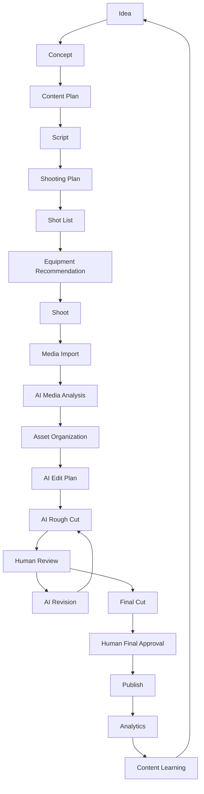

# Content Video OS — Product Understanding Report

**Domain OS:** Content Video OS (new)
**Phase:** 0 — Product Understanding
**Status:** `FROZEN 🔒` — Phase 0 architecture complete (Phase 0C review, Phase 0D correction, Final Consistency Audit). **Phase 1 is `AUTHORIZED — VERTICAL SLICE ONLY`** (see Architecture doc §17 and `01_ContentVideoOS_Phase1_Implementation_Map.md`).
**Revision:** incorporates Phase 0C and Phase 0D — see Architecture doc §15 (ADR-013, ADR-014) for the correction history and the Phase 1 scoping principle.
**Companion documents:** `00_ContentVideoOS_AI_Production_Contract.md`, `00_ContentVideoOS_Architecture_Governance_v0.1.md`
**Implementation status:** No code, schema, or repository changes. Nothing here touches PersonalLifeOS, Rider OS, Property OS, Finance OS, or any shared UEF/governance file.

---

### Contents
1. Product Definition · 2. Core Lifecycle · 3. Actors · 4. Major Entities · 5. Major Engines · 6. AI Responsibilities · 7. Human Responsibilities · 8. Approval Gates · 9. Equipment Model · 10. Media Model · 11. Content Lifecycle (stage-by-stage) · 12. Analytics → Learning Loop · 13. Major Risks · 14. Open Architectural Questions

---

## 1. Product Definition

Content Video OS is a new Domain OS in the existing Personal OS ecosystem — a peer to Rider OS, Property OS, Finance OS, and the rest, not a variant or replacement of any of them. Its domain is narrow and specific:

> **Content Production Lifecycle Management** — turning a raw idea into a published, analyzed piece of content, and turning that outcome into the next idea.

It is explicitly **not**: a video editor, a generic file/media manager, an AI chatbot, a social media platform, a general-purpose task manager, or a replacement for PersonalLifeOS, Finance OS, or Rider OS.

Its organizing principle: **AI does the production work; the human is Director and Approver.** Every AI capability in this system — ideation, shooting planning, media analysis, editing, learning — exists to remove manual production and editing labor. None of it exists to remove the human from creative or consequential decisions.

The product turns *"I have an idea"* into *"I know what to shoot, what to bring, what AI will do with the footage, what I need to approve, and what to make next."*

## 2. Core Lifecycle

The lifecycle is circular by design. Analytics and Content Learning feed back into new Ideas, so a single video is never a dead end — this is the **Content Loop**, and it's a first-class architectural concept, not an afterthought. The entity-level version of this same loop is formalized in Architecture & Governance v0.1 §2.

## 3. Actors

| Actor | Role |
|---|---|
| Human Creator / Director | Final authority on creative direction, edits, publication, and deletion. The only actor that can cross any of the five named gates — Production Go, Rough Cut Review, Final Approval, Publication Authorization, Delete (§8). |
| AI Creator | Turns raw ideas into structured, production-ready Concepts and Scripts. |
| AI Shooting Planner | Turns a Concept + Script into a Shot List and equipment recommendation, as part of one continuous planning workflow. |
| AI Media Analyst | Produces metadata and recommendations about imported footage without touching the source file. |
| AI Editor | Produces an auditable Edit Plan, executes it into a Rough Cut, and revises it on feedback. |
| AI Content Learning Engine | Compares published performance to history and proposes next ideas. |
| Equipment | A resource, not an actor — physical devices reasoned about by capability, not by name. |
| External Platforms | Passive recipients of publish actions and sources of analytics, reached only through adapters (see Architecture doc §11). |

## 4. Major Entities

A one-line glossary. Full cardinalities, relationships, and the reasoning behind what stayed separate vs. merged are in Architecture & Governance v0.1 §2.

| Entity | Definition |
|---|---|
| ContentIdea | A raw, lightly-structured content opportunity — a sentence, a topic, or an AI recommendation. Not yet production-ready. |
| ContentConcept | A structured, production-ready proposal derived from an Idea. Serves as the stable identity for everything downstream. |
| Script | The versioned narrative/spoken content for a Concept. |
| ProductionPlan | The shooting-day plan: logistics, equipment-for-the-day, and the Shot List. |
| Shot | A single required or optional visual capture within a plan. |
| Equipment | A physical production device. |
| CapabilityTag | A reference tag describing what a device can do (POV, A-Cam, Drone, ...) — a controlled vocabulary, not a per-device record. |
| Shoot | A real-world filming session. |
| Take | One captured attempt at a Shot. |
| MediaAsset | An imported source media file and its identity/traceability metadata. Never mutated. |
| MediaAnalysis | AI-generated, versioned observations about a MediaAsset. |
| EditProject | The editing effort associated with one Concept. |
| EditPlan | A versioned, auditable set of editing decisions. |
| EditVersion | The rendered result of executing an EditPlan (a Rough Cut or Final Cut), paired 1:1 with its Plan. |
| Review | A human's per-decision feedback on an EditVersion. |
| ContentOutput | A platform/format-specific rendered variant of an approved EditVersion. |
| Publication | The record of an actual publish action for a ContentOutput. |
| AnalyticsSnapshot | A point-in-time performance-metrics pull for a Publication. |
| ContentInsight | An AI-derived pattern across snapshots and publications. |
| ContentRecommendation | An AI-generated, actionable next-content suggestion citing one or more Insights. |

## 5. Major Engines

Full per-engine responsibility, inputs/outputs, commands, events, and failure modes are in Architecture & Governance v0.1 §3.

| Engine | One-line responsibility |
|---|---|
| ContentIdeaEngine | Capture and triage raw ideas |
| ContentConceptEngine | Generate structured concepts from ideas |
| ScriptEngine | Generate and version scripts |
| ProductionPlanEngine | Generate the shooting plan and shot list |
| EquipmentEngine | Own equipment/capability data; recommend gear |
| ShootEngine | Run Shoot Mode; track takes; fast in-field verification |
| MediaEngine | Deterministic ingestion of raw footage |
| MediaAnalysisEngine | AI batch analysis of footage |
| EditPlanEngine | Produce auditable edit decisions |
| EditEngine | Execute an edit plan into a rendered cut |
| ReviewEngine | Capture human review; drive revisions |
| PublicationEngine | Render outputs; manage the publish lifecycle |
| AnalyticsEngine | Record performance metrics |
| ContentLearningEngine | Compare performance; generate recommendations |

## 6. AI Responsibilities

**AI MAY:** recommend, generate, analyze, rank, edit, revise, optimize.

**AI MUST NOT, silently:** publish; delete original footage; overwrite approved content; change user intent; remove evidence; destroy previous versions.

Full per-function detail is in the AI Production Contract §A.

## 7. Human Responsibilities

The human holds final, non-delegable authority over: creative direction, final edit, publication, deletion, and any major change to content after it has been approved. This means retaining authority over consequential actions and final outcomes — not manually approving every intermediate AI-generated artifact (Phase 0D correction; see Architecture doc §7). Full per-gate detail is in the AI Production Contract §B.

## 8. Approval Gates

**Corrected under Phase 0D.** Planning-side generation — Idea → Concept → Script → Production Plan → Shot List → Equipment Recommendation — runs as one continuous, automatic AI workflow (the **AI Generation Lifecycle**: `AI_GENERATED → AI_VALIDATED → AI_RECOMMENDED → READY`, full detail in AI Production Contract §C). No individual click-through approval is required for the Concept, the Script, or the Plan merely because each is a separate artifact. The human can still inspect, edit, or redirect any of them at any point — that option is never removed — but the system doesn't wait for a click before the next stage starts.

Five named gates carry the actual, non-delegable human authority (CVOS-P7, Architecture doc §7):

1. **Production Go** — the whole planning package (Concept + Script + Plan + Shot List + Equipment) reaches `READY`; the human reviews it as one package and either authorizes it (`authorizeProductionGo`) or sends a specific piece back for revision. This is the *first* hard gate — nothing consumes real-world time or resources before it.
2. **Rough Cut Review** — after AI produces a Rough Cut, the human gives feedback (approve, or specific notes); AI revises until approved.
3. **Final Approval** — before a cut becomes authoritative and eligible for publication.
4. **Publication Authorization** — a separate decision from Final Approval; approving the edit is not approving the release.
5. **Delete** — deleting source media or an authoritative historical artifact is always explicit and auditable.

AI is never the actor that moves anything through one of these five gates. CVOS-P8 (Architecture doc §7) formalizes why an AI Recommendation, an AI Decision, and an AI Execution are three different things that never substitute for one another.

## 9. Equipment Model

Current equipment — OPPO Reno7 Pro, HONOR X70 ×2, HONOR 80 Pro Max, DJI Mini 3 Pro, DJI Osmo Action 6, DJI Mic 3 set — is structured system data, not hardcoded logic. Each device carries one or more capability tags (A-Cam, B-Cam, Static, POV, Action, Drone, B-Roll, Talking-Head, Audio, Backup). The system reasons about *what capability a shot needs*, then matches available equipment against it — a new camera added later is a data entry, not an engine change.

**Domain boundary — APPROVED.** Content Video OS's Equipment model is a **Production Capability Model**, not an Enterprise Physical Asset Inventory. It may own production-relevant equipment profiles, camera capabilities, production roles, production configuration, and AI suitability judgments for a specific shot — never the authoritative facts of physical-asset existence, ownership, quantity, location, condition, or lifecycle, which stay with Inventory OS if that OS later claims them. See Architecture doc §10 for the full boundary and the adapter/query approach for future reconciliation.

## 10. Media Model

Source media is treated as immutable evidence. AI analysis produces metadata and recommendations that reference the source — it never edits, moves, or deletes it. Every media asset should be traceable back to the Shoot, Equipment, Take, Shot, and Content Project it came from, wherever that information is available.

## 11. Content Lifecycle — stage by stage

| Stage | Entity created / changed | Owning engine | Gate before next stage |
|---|---|---|---|
| Idea | ContentIdea | ContentIdeaEngine | promoted for concept generation |
| Concept | ContentConcept | ContentConceptEngine | none — auto-continues into Script generation (Phase 0D correction) |
| Script | Script | ScriptEngine | none — auto-continues into Production Plan generation |
| Shooting Plan / Shot List / Equipment Recommendation | ProductionPlan, Shot | ProductionPlanEngine, EquipmentEngine | package reaches `READY` — human reviews the whole package |
| Production Go | ProductionPlan → `AUTHORIZED` | ProductionPlanEngine (human-triggered) | **first hard gate** — unlocks Shoot |
| Shoot | Shoot, Take | ShootEngine | shoot marked complete |
| Media Import | MediaAsset | MediaEngine | import verified |
| AI Media Analysis | MediaAnalysis | MediaAnalysisEngine | informational — no gate |
| AI Edit Plan | EditPlan | EditPlanEngine | auto-continues into Rough Cut generation (CVOS-P7, approved) — the hard gate is Human Review, not here |
| AI Rough Cut | EditVersion | EditEngine | enters Human Review |
| Human Review | Review | ReviewEngine | approve, or request revision |
| AI Revision | new EditPlan / EditVersion | EditPlanEngine, EditEngine | back to Human Review |
| Final Cut / Approval | EditVersion → `FINAL_APPROVED` | ReviewEngine | unlocks ContentOutput creation |
| Publish | ContentOutput, Publication | PublicationEngine | `PUBLISHED` |
| Analytics | AnalyticsSnapshot | AnalyticsEngine | informational — no gate |
| Content Learning / Next Content | ContentInsight, ContentRecommendation | ContentLearningEngine | new ContentIdea created |

## 12. Analytics → Learning Loop

Publication → AnalyticsSnapshot (raw metrics, append-only) → ContentInsight (a pattern, compared against historical baseline) → ContentRecommendation (a specific next-idea suggestion citing the Insight) → new ContentIdea. The Recommendation is explicitly tagged as AI-originated so it is never confused with a human's own idea (see AI Governance Contract, Architecture doc §7, CVOS-P3).

## 13. Major Risks

| Risk | Why it matters |
|---|---|
| AI-recommended shots or edits that are physically unsafe or impossible | The Shooting Planner is reasoning about the real world; a bad recommendation costs real time or safety, not just compute |
| Raw media storage growth | Action-cam/4K footage volume is an order of magnitude larger than anything else in this ecosystem currently handles; no archive policy yet exists for it (open question #6) |
| Dependence on external AI providers, a video-editing engine, and platform APIs | Any of these can change, rate-limit, or go down; each is a named external adapter (Architecture doc §11) precisely so this dependency is visible, not hidden |
| Approval-gate fatigue | Resolved under Phase 0D (Architecture doc §7, CVOS-P7 corrected): planning generation is one continuous automatic workflow with no per-artifact click; only five named consequential gates require a human action |
| Creative homogenization | A learning loop that always recommends "more of what already worked" can narrow the creator's range over time |
| Footage of other people | Delivery customers, bystanders, coworkers appearing in B-roll raises consent questions the pipeline should surface before publish, not after |
| Inconsistent platform analytics access | Not every platform's API exposes full retention/completion data; AnalyticsEngine must tolerate partial data rather than block or fabricate it |
| Scope creep | Drifting into generic file management, a full video editor, or social media management is explicitly out of this OS's domain |
| Confusion with Knowledge Governance OS | KGOS governs treaty/architecture documents (UEF/ADR/Blueprint); Content Video OS governs content production. Same AI-recommends/human-approves *pattern*, entirely different domain |
| Unclear coupling to other Domain OSes | The general principle is now approved (Architecture doc §1: consume via adapter, never own another OS's domain truth); no specific integration (Rider OS, Property OS, Finance OS, Inventory OS, PersonalLifeOS) is authorized or implemented yet |

## 14. Open Architectural Questions

Provisional directions for several of these are proposed — but not decided — in Architecture & Governance v0.1; each is marked `PROPOSED`, pending your review.

1. **Media storage backend** — Drive, consistent with the rest of the ecosystem, vs. a dedicated object store, given video file sizes are much larger than anything the ecosystem handles today. *See Architecture doc §9.*
2. **Cross-OS idea inspiration** — `RESOLVED AT THE PRINCIPLE LEVEL`: Content Video OS may consume other Domain OS data via an adapter/query contract, never by owning it (Architecture doc §1). Each specific integration (Rider OS, Property OS, Finance OS, Inventory OS, PersonalLifeOS) remains `OPEN — PENDING ARCHITECTURAL DECISION` and unimplemented.
3. **Equipment master data ownership** — `RESOLVED AT THE PRINCIPLE LEVEL`: Content Video OS owns a Production Capability Model locally; it must never become the authoritative physical-asset inventory (Architecture doc §10). Whether/when Inventory OS reconciliation actually happens remains `OPEN — PENDING ARCHITECTURAL DECISION`.
4. **What "Publish" actually means** — still `OPEN — PENDING ARCHITECTURAL DECISION`: does the system call the platform API itself (under human approval), or does it only mark `READY_TO_PUBLISH` while a human posts manually outside the system? This changes what PublicationEngine is responsible for.
5. **Approval granularity** — `RESOLVED under Phase 0D`: no per-artifact approval exists for Concept/Script/Plan at all — they form one automatic planning workflow ending in `READY`. The first human gate is Production Go, reviewing the whole package at once (Architecture doc §7, CVOS-P7 corrected; see ADR-013 for the correction history). The Phase 0C "one action per artifact" assumption is superseded.
6. **Archive/retention policy for raw footage**, given its size — no direction proposed yet; flagged as needing a decision before Phase 2 implementation (Architecture doc §17).
7. **Single-user vs. crew** — nothing in the brief suggests multi-user, but the domain model doesn't yet explicitly rule it out either.
8. **A possible existing cross-OS "Idea Inbox"** — if Personal Life OS already has a general idea/task capture concept, should ContentIdea feed into it instead of duplicating it? Not confirmed either way.
